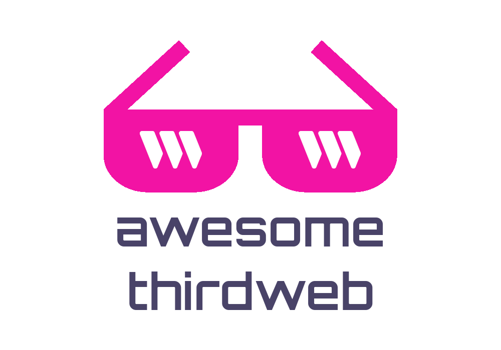

# Awesome thirdweb  <!-- omit from toc -->

> A curated list of awesome thirdweb resources, libraries, examples, showcase, and open source projects. 📌✨

## What is thirdweb? <!-- omit from toc -->

[thirdweb](https://thirdweb.com) is a complete web3 development framework. Smart Contracts and SDKs for developers, dashboard and no-code tools for everyone.

## Contents <!-- omit from toc -->

- [✅ Official](#-official)
- [⭐ Showcase](#-showcase)
- [📜 Smart Contracts](#-smart-contracts)
  - [Pre-Built Contracts (Official)](#pre-built-contracts-official)
  - [Community Contract Releases](#community-contract-releases)
- [🧰 Tools](#-tools)
- [📚 Resources](#-resources)
- [🎓 Tutorials](#-tutorials)
  - [Blogs](#blogs)
  - [Videos](#videos)

## ✅ Official

- [Website](https://thirdweb.com)
- [Twitter](https://twitter.com/thirdweb)
- [Discord](https://discord.gg/thirdweb)
- [YouTube](https://youtube.com/@thirdweb_)
- [GitHub](https://github.com/thirdweb-dev)

## ⭐ Showcase

- [The Nutleys](https://opensea.io/collection/the-nutleys) - Community of 9,999 peanuts - hand-drawn and algorithmically roasted on the Ethereum blockchain.
- [Serious Platypus Verse](https://opensea.io/collection/serious-platypus-verse) - We are supporting environmental advocates through this 105 unique genesis collection of serious platypus.
- [Bridgette](https://bridgette.one) - One Bridge To Rule Them All. Taking all your favorite bridges and putting them under a cohesive interface that focuses on YOU.
- [Crypto Dog Society](https://cryptodogsociety.com) - The Crypto Dog Society is a private collection of 7777 unique 3D art pieces design by William Gaspar and Nathan Torelli.
- [CareerUp Job Website](https://careerdev.vercel.app/)- Careerup is a web3 based job apllication dapp, where user get to list a job, or apply for a specifiic job, while employer can also host video interviews for the selected candidate on the dapp.
- [Inmate Tate](https://www.inmatetate.com) - A collection of 12,345 inmate tate nfts, convicted to the blockchain for eternity.
- [Moonapes Yacht Club](https://www.moonapesnft.xyz) - They're a collection of 3,333 utility-enabled PFPs that feature a richly diverse and unique pool of rarity-powered traits.
- [Wotify Collection - Wotify Minting Dapp](https://sigbature-drop-template-code.vercel.app) - Created by Wotify NFTs, Wotify is a collection of 30k png NFTs living on the Ethereum blockchain, and is inspired by a famous MMO strategy game. The Wotify Minting DApp itself will give you the abillity to mint the Wotify NFTs in two ways. You can claim the NFTs through the standard mint option for the set price or if you own the free-to-mint Wotify Premium Key aka community key *coming soon*, you can claim the NFTs with a 50% discount. Wotify collection is coming soon. January 2023.
- [Ethenials](http://ethenials.com) - 5,000 unique full-body pixel beings perfectly contained within an 81 by 81 pixel canvas, featuring 4 skin tones, 2 genders and 5 species to choose from.
- _Have a project built on thirdweb? Submit now!_ 🥺

## 📜 Smart Contracts

### Pre-Built Contracts (Official)

- [NFT Drop](https://thirdweb.com/thirdweb.eth/DropERC721) - The NFT Drop contract is ideal when you want to release a collection of unique NFTs using the ERC721A Standard.
- [Edition Drop](https://thirdweb.com/thirdweb.eth/DropERC1155) - The Edition Drop contract is best used when you want to release many NFTs based on the same asset and uses the ERC1155 Standard, also known as "Semi-Fungible Tokens".
- [Signature Drop](https://thirdweb.com/thirdweb.eth/SignatureDrop) - The Signature Drop contract uses the ERC721A standard to release a collection of unique one-of-one NFTs.
- [Token Drop](https://thirdweb.com/thirdweb.eth/DropERC20) - The Token Drop contract is a way of releasing your ERC20 tokens for a set price.
- [NFT Collection](https://thirdweb.com/thirdweb.eth/TokenERC721) - The NFT Collection contract is suitable for when you want to have a collection of unique NFTs, but not "drop" or "release" them for your community to claim.
- [Edition](https://thirdweb.com/thirdweb.eth/TokenERC1155) - The Edition contract is best used when you want to release many NFTs based on the same asset, but you don't want to "drop" or "release" them for your community to claim.
- [Token](https://thirdweb.com/thirdweb.eth/TokenERC20) - The Token contract is suited for creating a digital currency and is compliant with the ERC20 standard.
- [Marketplace](https://thirdweb.com/thirdweb.eth/Marketplace) - A Marketplace is a contract where you can buy and sell NFTs, such as OpenSea or Rarible.
- [Multiwrap](https://thirdweb.com/thirdweb.eth/Multiwrap) - The Multiwrap contract lets you wrap ERC20, ERC721 and ERC1155 tokens into a new wrapped ERC721 NFT.
- [Pack](https://thirdweb.com/thirdweb.eth/Pack) - The pack contract lets you bundle ERC20, ERC721 and, ERC1155 tokens together into ERC1155 NFTs that act as randomized loot boxes.
- [Vote](https://thirdweb.com/thirdweb.eth/VoteERC20) - The Vote contract is designed for groups such as DAOs to vote on proposals.
- [Airdrop ERC-20](https://thirdweb.com/thirdweb.eth/AirdropERC20) - Airdrop ERC20 tokens or the chain's native token (e.g. ether for Ethereum mainnet) to a list of recipients.
- [Airdrop ERC-721](https://thirdweb.com/thirdweb.eth/AirdropERC721) - Airdrop ERC721 NFTs to a list of recipients.
- [Airdrop ERC-1155](https://thirdweb.com/thirdweb.eth/AirdropERC1155) - Airdrop ERC1155 NFTs to a list of recipients.
- [NFT Stake](https://thirdweb.com/thirdweb.eth/NFTStake) (Beta) - This contract allows users to stake their ERC-721 NFTs and get ERC-20 tokens as staking rewards.

### Community Contract Releases

- [Dynamic Free Mint](https://thirdweb.com/nach.eth/DynamicFreeMint) - With this contract, you can limit how many NFTs each wallet can claim for free.
- [The Public Lock Contract](https://thirdweb.com/unlock-protocol.eth/PublicLock) - The Public Lock Contract is a membership contract from Unlock Protocol. This contracts lets you create recurring subscriptions, tickets, certifications.
- [Rental NFTs](https://thirdweb.com/doubledev.eth/ERC4907) - ERC-4907 facilitates the efficient implementation of rentable NFTs.
- [ERC-721 Community Stream](https://thirdweb.com/flairsdk.eth/ERC721CommunityStream) - Allows you to create a token stream to equally distribute any tokens (Native, ERC20, etc) to holders of a specific ERC721 NFT collection.
- [Job Application](https://thirdweb.com/0x013166D598AB78A8ddf8C1bF34Ff9bC7C50D36D2/CareerBuild) - job application smart contract allow users to list ajob, apply for a job.
- _Have a community contract release? Submit now!_

## 🧰 Tools

- [The thirdweb Art Engine](https://github.com/warengonzaga/thirdweb-art-engine) - The forked version of HashLips Art Engine with better features and compatibility with thirdweb.
- [Hashlips Art Engine](https://github.com/HashLips/hashlips_art_engine) - Create generative art by using the canvas api and node js.
- [IPFS Support Extension](https://github.com/warengonzaga/ipfs-support-extension) - Adding standalone IPFS native URL support for chromium based browsers without installing IPFS in your machine.
- _Have a community tool for thirdweb? Submit now!_

## 📚 Resources

- [TW Demo Asssets](https://github.com/saminacodes/tw-demo-assets) - Different assets use for demo projects at thirdweb.
- [NFT Dummy Assets](https://github.com/warengonzaga/nft-dummy-assets) - Making test NFT deploment easier by providing dummy NFT arts with metadata. 100% compatible with thirdweb platform.
- _Have a community resources for thirdweb? Submit now!_

## 🎓 Tutorials

### Blogs

- Build an RPG game on Solana. [[Link](https://metamake.hashnode.dev/build-an-rpg-game-on-solana#heading-generate-the-pngs)]
- How to use RainbowKit with Thirdweb. [[Link](https://blog.avneesh.tech/how-to-use-rainbowkit-with-thirdweb)]
- _Have a community tutorial blog for thirdweb? Submit now!_

### Videos

- HashLips playlist for thirdweb. [[Link](https://www.youtube.com/watch?v=OlavWoKV1Mk&list=PLvfQp12V0hS3tHI5-4olIYqH6LM8YWL63)]
- Creating a gasless NFT Drop. [[Link](https://www.youtube.com/watch?v=FQKnUdxKLg4)]
- Create token gated website using existing token. [[Link](https://www.youtube.com/watch?v=gFy7VuLq8II)]
- How to create an NFT collection. [[Link](https://www.youtube.com/watch?v=DSffICxyj3A)]
- How to create an ERC 20 token + mint NFT with custom ERC-20. [[Link](https://www.youtube.com/watch?v=FoIp1KSyh_w)]
- _Have a community video tutorial for thirdweb? Submit now!_

---

💻💖☕ by [Waren Gonzaga](https://warengonzaga.com) | [He is Awesome](https://www.youtube.com/watch?v=HHrxS4diLew&t=44s) 🙏
