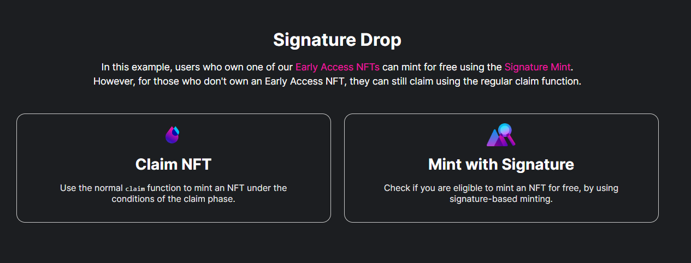

## Wotify NFTs Minting DApp - Template code for thirdweb's signature-drop contract

A fully working DApp/code is provided by the thirdweb.
You can find the original thirweb's code and repo [here](https://github.com/thirdweb-example/signature-drop)

You can find my version of the original repo [here](https://github.com/wotify/sigbature-drop-template-code)

Btw, the name of my repo should have bin * signature-drop-template-code * and not the * sigbature-drop-template-code * as it stands now at wotify nfts GitHub home, but I probably type too fast for...

As I said above the fully operational and working DApp is provided by the thirdweb, and I added a little bit more functionality and basic styling. The original code has mint quantity set to 1 for both mint buttons by default so I added the quantity buttons in order to enable more than 1 mint per 1 transaction. You can change in code in the index.tsx the max mint quantity to another desired max value...That was the main goal...

Summary -- I added:
1 mint quantity + and - buttons
2 sounds
3 sound control - toggle DApp sound on and off button
4 new mint detector - 2 light bulbs - should blink when you mint and when someone else mints
5 cool and simple css animations and transitions for some page elements on rendering
6 css styling
7 dynamic alerts for the user describing every action on the page user takes, embedded in the page -- not classic browser alerts
8 dynamic mint price info below mint buttons and in user alerts
9 more basic logic for better UX
10 in the future...third mint button for 1 FREE mint per collection with special key -- key will be signature-drop probably or NFT drop

all questions: wotify@tokenrolla.com or dm at Twitter @wotify_NFTs

## How to use the repo for your collection/signature-drop


If you decide to use this repo, more or less you should follow these steps:

Enter your signature-drop address at 2 files: index.tsx and generate-mint-signature.ts
Enter your key-nft edition-drop address in generate-mint-signature.ts
In app.tsx enter the appropriate chain id: ChainId.your_chain_id  ..chain where your signature-drop is deployed..

1 go to repo [here](https://github.com/wotify/sigbature-drop-template-code) 
2 click on ..Use this template...
3 Create a new repository
4 you get your new repo with no commits inside..just the initial commit
5 clone the new repo on your local pc
6 cd into the project folder
7 create a new file named .env.local
8 enter your private key in .env.local
8/1 make sure that you have the newest Microsoft Visual Studio installed and also the C++ desktop dev tools pack
9 install all dependencies with the command: npm install
10 if there is some errors read and npm install what is missing
11 make sure that you have the latest version of thirdweb's sdk installed by
12 running: npm install @thirdweb-dev/sdk @thirdweb-dev/react
13 for the dev server run: yarn dev
14 that should be it
15 sign up at Vercel with GitHub
16 deploy your new DApp through Vercel..it's easy and you get CI/CD..

You can see wotify DApp in action [here](https://sigbature-drop-template-code.vercel.app/)

You can use the standard mint button to test the DApp. Just send some Goerly ETH to your Metamask and switch the network to Goerly...I deployed one test signature-drop collection on Goerly...

all good ✌

Below,  you can find the original thirdweb's repo description for more details...


# Signature Drop

This example shows how you can use the [Signature Drop Pre-Built Contract](https://portal.thirdweb.com/pre-built-contracts/signature-drop) to
utilize both the [claim](https://portal.thirdweb.com/pre-built-contracts/signature-drop#minting--claiming-nfts) function to claim NFTs under the criteria
of a claim condition, as well as the [Signature-based minting](https://portal.thirdweb.com/advanced-features/on-demand-minting) feature to
offer free NFT mints to specific users simultaneously.



We allow users who hold one of our [Early Access NFTs](https://opensea.io/collection/thirdweb-community) to mint the NFT for free, by generating a mint signature from the admin wallet on the server-side. Whereas users who _don't_ hold one of the NFTs do not qualify for the mint signature, but can still mint an NFT from the drop using the regular claim.

## Tools

- [Signature Drop](https://portal.thirdweb.com/pre-built-contracts/signature-drop) to lazy mint NFTs for other wallets to claim.
- [React SDK](https://portal.thirdweb.com/react) to connect to user's wallets and interact with the smart contract.

## Create Your Own

You can create a project using this example with the [thirdweb CLI](https://portal.thirdweb.com/thirdweb-cli) by running the below command:

```bash
npx thirdweb create --template signature-drop
```

Export your wallet's private key and add it to an `.env.local` file in your project directory.

```bash
PRIVATE_KEY=your-private-key
```

## Guide

Let's explore the key areas of the application and how the code works.

### Connecting to user's wallets and our contract

We wrap our application in the `ThirdwebProvider` component in the [\_app.tsx](./pages/_app.tsx) file.

```jsx
// This is the chainId your dApp will work on.
const activeChainId = ChainId.Goerli;

function MyApp({ Component, pageProps }: AppProps) {
  return (
    <ThirdwebProvider desiredChainId={activeChainId}>
      <Component {...pageProps} />
      <ThirdwebGuideFooter />
    </ThirdwebProvider>
  );
}
```

Now we can utilize all of the functionality of the [React SDK](https://portal.thirdweb.com/react) to connect to the user's wallets and their network on the [index.tsx](./pages/index.tsx) file.

```jsx
const address = useAddress();
const connectWithMetamask = useMetamask();
const isMismatch = useNetworkMismatch();
const [, switchNetwork] = useNetwork();
```

We then connect to our signature drop contract by using its contract address:

```jsx
const signatureDrop = useSignatureDrop(
  "0xb90a18e9270d44F6e7D06e5Eac32C6Ea881CCaB2"
);
```

### Claiming NFTs

To claim NFTs the typical way, we use the `claimTo` function:

```jsx
const tx = await signatureDrop?.claimTo(address, 1);
```

### Signature-Based Minting NFTs

Signature-based minting is a three-step process:

1. The user requests a mint signature.
2. Admin wallet (on the server) approves (or denies) the claim request of the user based on any criteria the admin chooses and sends back a mint signature when they approve.
3. The user uses the mint signature to claim NFTs from the signature drop.

Firstly, we request a mint signature from the API:

```jsx
const signedPayloadReq = await fetch(`/api/generate-mint-signature`, {
  method: "POST",
  body: JSON.stringify({
    address: address,
  }),
});
```

Then, on the server-side API route, we make a check to see if the user qualifies for the mint signature by checking to see if they own any early access NFTs:

```jsx
// De-construct body from request
const { address } = JSON.parse(req.body);

// Get the Early Access NFT Edition Drop contract
const polygonSDK = new ThirdwebSDK("polygon");
const earlyAccessNfts = polygonSDK.getEditionDrop(
  "0xa9e893cc12026a2f6bd826fdb295eac9c18a7e88"
);

// Check to see if the wallet address has an early access NFT
const numTokensInCollection = await earlyAccessNfts.getTotalCount();
let userHasToken = false;
// Check each token in the Edition Drop
for (let i = 0; i < numTokensInCollection.toNumber(); i++) {
  // See if they have the token
  const balance = await earlyAccessNfts.balanceOf(address, i);
  if (balance.toNumber() > 0) {
    userHasToken = true;
    break;
  }
}
```

If they do, we generate a mint signature from the admin wallet on the server-side:

```jsx
  // Now use the SDK on Goerli to get the signature drop
  const goerliSDK = ThirdwebSDK.fromPrivateKey(
    process.env.PRIVATE_KEY as string,
    "goerli"
  );
  const signatureDrop = goerliSDK.getSignatureDrop(
    "0xb90a18e9270d44F6e7D06e5Eac32C6Ea881CCaB2"
  );

  // If the user has an early access NFT, generate a mint signature
  if (userHasToken) {
    const mintSignature = await signatureDrop.signature.generate({
      to: address, // Can only be minted by the address we checked earlier
      price: "0", // Free!
      mintStartTime: new Date(0), // now
    });

    res.status(200).json(mintSignature);
  } else {
    res.status(400).json({
      message: "User does not have an early access NFT",
    });
  }
```

When this is done, we handle it on the client-side, by showing an error alert if they didn't qualify, or continuing to use this mint signature to claim an NFT if they did:

```jsx
if (signedPayloadReq.status === 400) {
  alert(
    "Looks like you don't own an early access NFT :( You don't qualify for the free mint"
  );
  return;
} else {
  try {
    const signedPayload =
      (await signedPayloadReq.json()) as SignedPayload721WithQuantitySignature;

    const nft = await signatureDrop?.signature.mint(signedPayload);

    alert(`Succesfully minted NFT!`);
  } catch (error: any) {
    alert(error?.message);
  }
}
```

## Join our Discord!

For any questions, suggestions, join our discord at [https://discord.gg/thirdweb](https://discord.gg/thirdweb).
